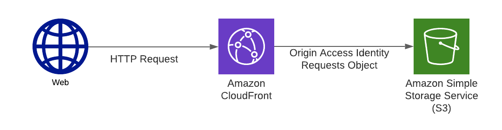

My goto serverless stack for super speed to production web applications, and RESTful APis, is CloudFront, S3, API
Gateway, and Lambda. CloudFront provides the front door to the application, serving static content from S3 and providing
paths to API Gateway APIs - no CORS here.

CloudFront can be leveraged for caching and routing to APIs, CMSes, etc. It's a nice cheap setup with quite a lot of
flexibility and integration with AWS services. This website is served by CloudFront
and [AWS CodePipeline](https://aws.amazon.com/codepipeline/) provides the CI/CD. I prefer working with that flexibility,
however if you want something light and quick you can check out [AWS Amplify](https://aws.amazon.com/amplify/)
or [Netflify](https://www.netlify.com/).

The CloudFormation templates in this repo cover creating the base for this stack by serving static content using AWS
CloudFront (the CDN), S3 (
storage for the static content). The S3 bucket is private with serverside encryption enabled by default. AWS Route 53 (
DNS service) is configured to have requests sent to a custom domain routed to the CloudFront distribution created in
this tutorial.

# What if I don't want a custom domain

[Follow these instructions instead](#no-domain-no-problem)

# Costs

Warning! You will incur costs by following this tutorial.

| Service | Cost |
|---------|------|
| Domain name | .com goes for around €8 for one year (€11 to renew) with [Namecheap](www.namecheap.com) |
| [AWS Route 53 hosted zone](https://aws.amazon.com/route53/pricing) | 1 x €0.50 per month |
| [AWS CloudFront](https://aws.amazon.com/cloudfront/pricing/) | Charged on data transfer out & http/https requests |
| [AWS S3]() | You pay for storage, requests, and retrievals - Caching will make retrieval minimal |

# Step 1: Register a Domain Name

You can use AWS Route 53 to register a domain name by
following [these instructions](https://docs.aws.amazon.com/Route53/latest/DeveloperGuide/domain-register.html).
Alternatively you can use your favourite domain registrar to register a domain. My favourite
is [Namecheap](www.namecheap.com) due to their low prices, customer support, and tooling.

```
example.com
www.example.com
```

# Step 2: Create a Hosted Zone

If you decided to use AWS Route 53 to register a domain name then a Route 53 hosted zone will already have been created
for you. Take note of the Hosted Zone Id. Now go straight to step 4.

Otherwise, if you decided to use a domain registrar other than AWS Route 53 then create an AWS Route 53 hosted zone by
using the following CloudFormation template `hosted-zone.yaml`.

Use the following AWS CLI command to create the hosted zone:

```bash
aws cloudformation deploy \
--template-file hosted-zone.yaml \
--stack-name mystaticwebsite-hosted-zone \
--parameter-overrides \
DomainName=<your fully qualified domain name>
```

Run the following AWS CLI command to get the hosted zone id and the hosted zone nameservers:

```bash
aws cloudformation describe-stacks \
--stack-name mystaticwebsite-hosted-zone
```

Look for the `"Outputs"` JSON element in the output of the above command. It should look like this:

```json
"Outputs": [
{
"OutputKey": "HostedZoneId",
"OutputValue": "<this will be your hosted zone id>",
"Description": "The Hosted Zone Id",
"ExportName": "mystaticwebsite-hosted-zone-HostedZoneId"
},
{
"OutputKey": "HostedZoneNameServers",
"OutputValue": "<this will be a comma separated list of the nameservers associated with your hosted zone>",
"Description": "The Hosted Zone Name Servers",
"ExportName": "mystaticwebsite-hosted-zone-HostedZoneNameServers"
}
],
```

Take note of the hosted zone id, and the comma separated list of hosted zone name servers.

# Step 3: Set Route 53 as the DNS service for the domain

To successfully have traffic to the domain routed to the CloudFront distribution, Route 53 needs to be set as the DNS
service for the domain. To achieve this, the nameservers for the domain need to be set to the nameservers for the Route
53 hosted zone created in Step 2. The nameservers for the Route 53 hosted zone can be found in the comma separated list
of the `"OutputValue"` in the output from the CloudFormation describe CLI command in Step 2.

The domain registrar used to register the domain will have a console that can be used to update the nameservers for the
domain. For
example [these are the instructions for Namecheap](https://www.namecheap.com/support/knowledgebase/article.aspx/767/10/how-to-change-dns-for-a-domain/)

# Step 4: Create the Certificate

With the creation of the Route 53 hosted zone, and with Route 53 as the DNS service for the domain, the certificate for
the static website and can be created and automatically validated by AWS Route 53. The following CloudFormation template
creates the certificate using AWS ACM, however it must be created in the `us-east-1` region otherwise it cannot be used
with CloudFront: `acm-certificate.yaml`

This is the AWS CLI command to create the stack:

```bash
aws cloudformation deploy \
--template-file acm-certificate.yaml \
--stack-name mystaticwebsite-acm-certificate \
--region us-east-1 \
--parameter-overrides \
DomainName=<your fully qualified domain name> \
HostedZoneId=<hosted zone id>
```

Notice the region is set to `us-east-1`. This is necessary otherwise the certificate won't work with CloudFront.

Once the stack is created, run the following command to get the certificate ARN, this is required when creating the
CloudFront distribution.

```bash
aws cloudformation describe-stacks \
--region us-east-1 \
--stack-name mystaticwebsite-acm-certificate
```

The `Outputs` JSON element will look like this:

```json
"Outputs": [
{
"OutputKey": "CertificateArn",
"OutputValue": "arn:aws:acm:us-east-1:111111111111:certificate/b8d0e2c9-daf7-42e8-a59b-3693bc299c32",
"Description": "The Certificate ARN",
"ExportName": "mystaticwebsite-acm-certificate-CertificateArn"
}
],
```

Take note of the ARN which will look like
this: `arn:aws:acm:us-east-1:111111111111:certificate/b8d0e2c9-daf7-42e8-a59b-3693bc299c32`

# Step 5: Create The CloudFront Distribution

The following CloudFormation template creates the Origin Access Identity, static resources S3 bucket, and CloudFront
distribution: `cloudfront-distribution.yaml`.

Run the following command to create the CloudFormation stack:

```bash
aws cloudformation deploy \
--template-file cloudfront-distribution.yaml \
--stack-name mystaticwebsite-cloudfront-distribution \
--parameter-overrides \
DomainName=<your domain name> \
CertificateArn=<certificate arn>
```

## Origin Access Identity

The Origin Access Identity allows CloudFront to read from the S3 bucket without having to make the S3 bucket public.

## S3 Bucket

The static content is stored in the S3 bucket from which CloudFront will serve the content. My preference is to encrypt
all data whether it's at rest or in-flight, so here serverside encryption is enabled by default. It's data that will be
publicly accessible through CloudFront, so the default AWS S3 key would appear to be adequate here despite it being a
shared key across AWS accounts.

The S3 bucket is explicitly configured as private with the `PublicAccessBlockConfiguration`.

## S3 Bucket Policy

It is necessary to give `s3:GetObject` permission to the Origin Access Identity so that CloudFront can request items
from the S3 bucket. This means that the bucket can be kept private but that CloudFront can still access the static
content within.

## Cache Policy

The cache policy id for the default cache behaviour is set to
the [managed cache policy](https://docs.aws.amazon.com/AmazonCloudFront/latest/DeveloperGuide/using-managed-cache-policies.html) `658327ea-f89d-4fab-a63d-7e88639e58f6`

- Managed-CachingOptimized - which means caching is enabled and CloudFront cache invalidation is required after making
  changes to static content files.

## Try It Out

It should now be possible test the CloudFront distribution. Upload an `index.html` file to the S3 bucket then send an
HTTP request to the CloudFront URL. The name of the S3 bucket and CloudFront URL are required. Run the following command
to get the CloudFront distribution stack outputs:

```bash
aws cloudformation describe-stacks \
--stack-name mystaticwebsite-cloudfront-distribution
```

The output should look like the following:

```json
"Outputs": [
{
"OutputKey": "DistributionId",
"OutputValue": "<distribution Id>",
"Description": "CloudFront Distribution Id",
"ExportName": "mystaticwebsite-cloudfront-distribution-DistributionId"
},
{
"OutputKey": "DistributionDomainName",
"OutputValue": "d1111111111111.cloudfront.net",
"Description": "CloudFront Distribution Domain Name",
"ExportName": "mystaticwebsite-cloudfront-distribution-DistributionDomainName"
},
{
"OutputKey": "StaticResourcesBucketName",
"OutputValue": "mystaticwebsite-cloudfront-staticresourcesbucket-1ab0a0a0a9abc",
"Description": "Static Resources Bucket Name",
"ExportName": "mystaticwebsite-cloudfront-distribution-StaticResourcesBucketName"
}
],
```

Take note of the `OutputValue` of `"OutputKey": "DistributionDomainName"` and `"OutputKey": "StaticResourcesBucketName"`
.

Run the following command to create a file name `index.html` and upload it to the S3 bucket:

```bash
echo 'My Static Content' > index.html && \
aws s3 cp index.html s3://<static resources bucket name>
```

With a browser, request the CloudFront URL taken from the stack output to see the content returned from CloudFront.
Alternatively the following cURL command can be used:

```bash
curl https://<cloudfront distribution domain>
```

The response should look like this:

```
My Static Content
```

# Step 6: Route Traffic To The CloudFront Distribution

A further step is required to have requests to the domain routed to the CloudFront distribution. It requires Route 53
alias records to be created:

1. IPV4 alias record (A) pointing the root domain to the CloudFront distribution
1. IPV4 alias record (A) pointing the `www` subdomain to the CloudFront distribution
1. IPV6 alias record (AAAA) pointing the root domain to the CloudFront distribution
1. IPV6 alias record (AAAA) pointing the `www` subdomain to the CloudFront distribution

The following CloudFormation template sets up the appropriate records: `hosted-zone-record-set-group.yaml`

Run the following command to create the CloudFormation stack:

```bash
aws cloudformation deploy \
--template-file hosted-zone-record-set-group.yaml \
--stack-name mystaticwebsite-record-set-group \
--parameter-overrides \
DomainName=<your domain name> \
HostedZoneId=<hosted zone id> \
DistributionDomainName=<cloudfront distribution domain name>
```

## Try it Out

Navigate to the domain name in a browser or run the following command:

```bash
curl https://<your domain name>
```

The following should be returned:

```
My Static Content
```

# No domain no problem

If no domain is required, and hitting the CloudFront distribution domain directly is adequate for your needs, then this
single CloudFormation template will suffice: `cloudfront-distribution-no-custom-domain.yaml`.

Run the following command to create the CloudFormation stack:

```bash
aws cloudformation deploy \
--template-file cloudfront-distribution-no-custom-domain.yaml \
--stack-name mystaticwebsite-cloudfront-distribution
```

```bash
aws cloudformation describe-stacks \
--stack-name mystaticwebsite-cloudfront-distribution
```

The output should look like the following:

```json
"Outputs": [
{
"OutputKey": "DistributionId",
"OutputValue": "<distribution Id>",
"Description": "CloudFront Distribution Id",
"ExportName": "mystaticwebsite-cloudfront-distribution-DistributionId"
},
{
"OutputKey": "DistributionDomainName",
"OutputValue": "d1111111111111.cloudfront.net",
"Description": "CloudFront Distribution Domain Name",
"ExportName": "mystaticwebsite-cloudfront-distribution-DistributionDomainName"
}
],
```

Take note of the `OutputValue` of `"OutputKey": "DistributionDomainName"` and `"OutputKey": "StaticResourcesBucketName"`
.

Run the following command to create a file name `index.html` and upload it to the S3 bucket:

```bash
echo 'My Static Content' > index.html && \
aws s3 cp index.html s3://<static resources bucket name>
```

With a browser, request the CloudFront URL taken from the stack output to see the content returned from CloudFront.
Alternatively the following cURL command can be used:

```bash
curl https://<cloudfront distribution domain>
```

The response should look like this:

```
My Static Content
```